# Домашнее задание к занятию «Хранение в Kubernetes» студента Аль-Ассафа Ильи

---

# Задание 1. Volume: обмен данными между контейнерами в Pod

## Цель

Создать Deployment из двух контейнеров (`busybox` и `network-multitool`), использующих общий том `emptyDir`.

## Выполнение

Создан Deployment `data-exchange`, содержащий:

- контейнер **busybox**, записывающий текущую дату в файл каждые 5 секунд;
- контейнер **network-multitool**, отображающий содержимое файла командой `tail -f`.

Общий каталог реализован с помощью `emptyDir`.

### Проверка

Описание Pod:

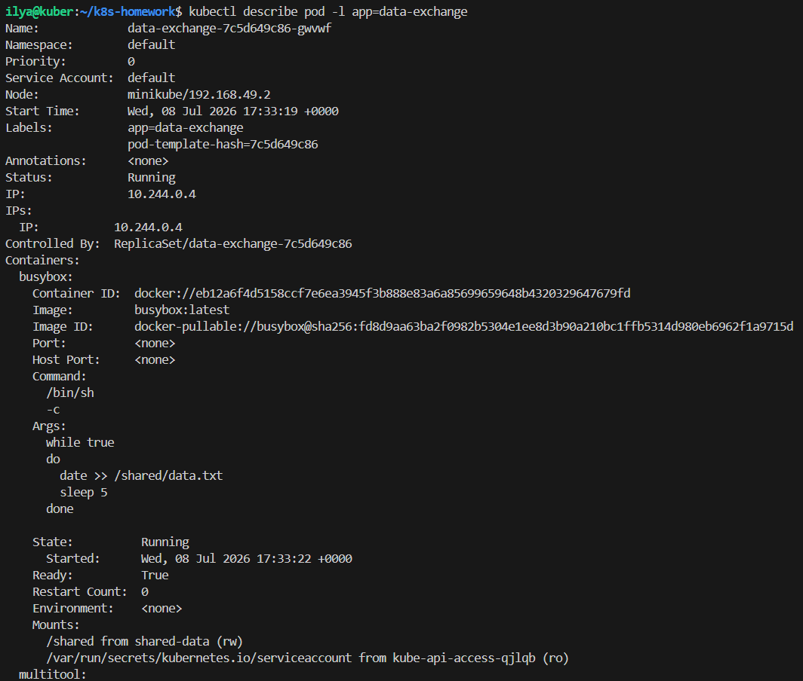
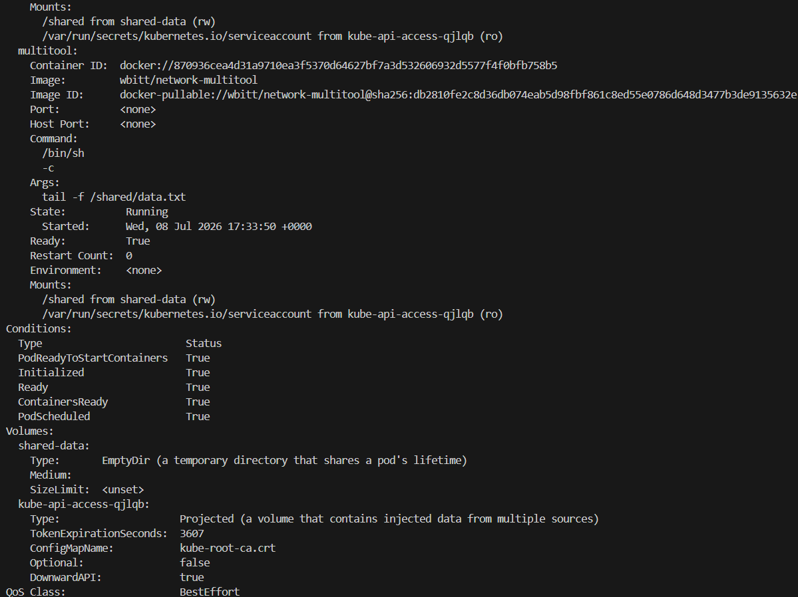

Просмотр содержимого файла:

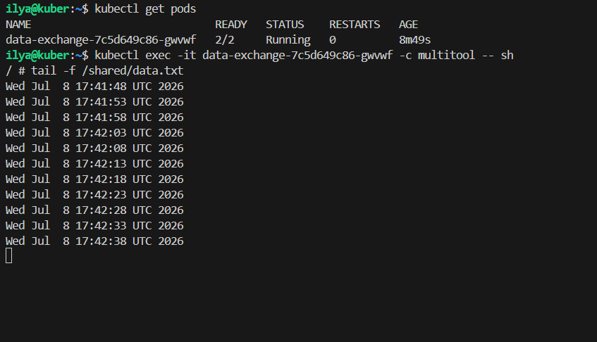

---

# Задание 2. PersistentVolume и PersistentVolumeClaim

## Цель

Создать локальный PersistentVolume и использовать его через PersistentVolumeClaim.

## Выполнение

Созданы:

- PersistentVolume `local-pv`;
- PersistentVolumeClaim `local-pvc`;
- Deployment `data-exchange-pvc`.

В качестве постоянного хранилища использован `hostPath`.

### Создание каталога

Каталог для хранения данных создан внутри ноды Minikube.

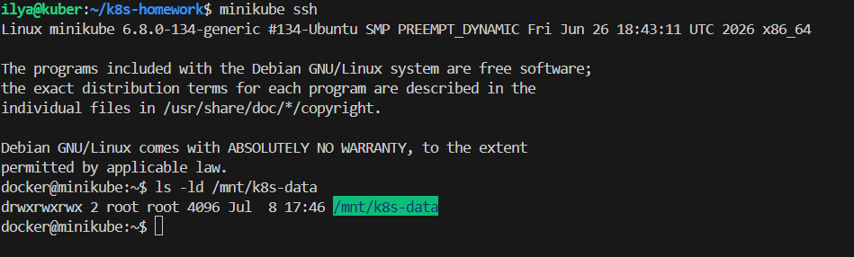

---

### Создание ресурсов

После применения манифеста все ресурсы успешно созданы.

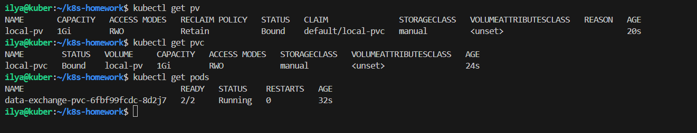

---

### Проверка записи

Контейнер `busybox` записывает дату в файл.

Контейнер `network-multitool` успешно читает этот файл.

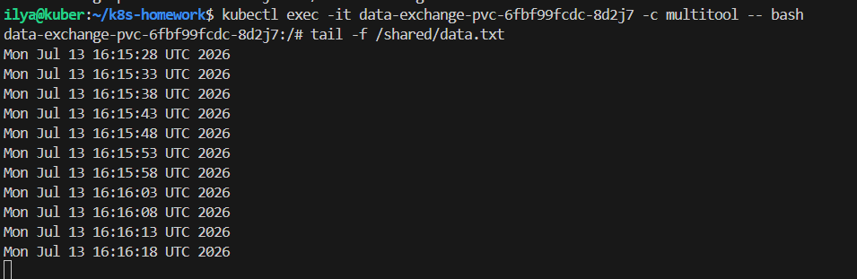

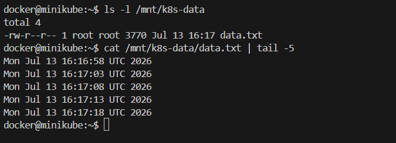

---

### Проверка состояния PV после удаления PVC

После удаления Deployment и PVC состояние PV изменилось на **Released**.

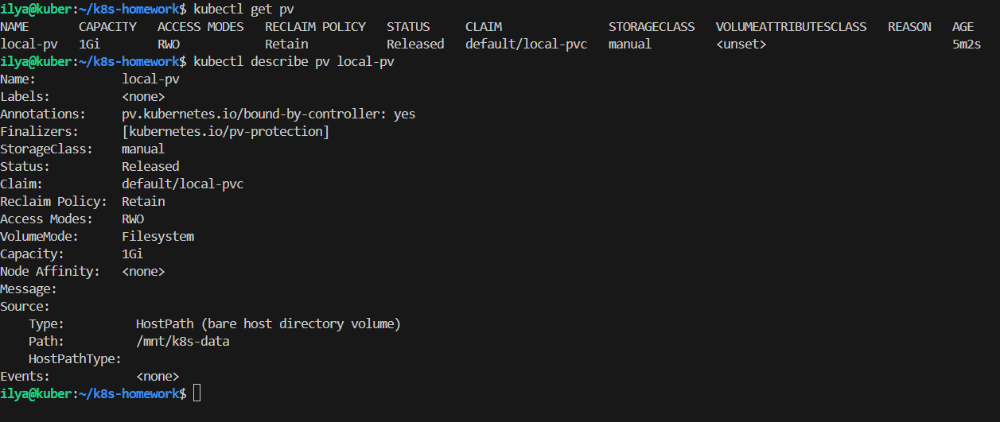

### Почему PV не удалился?

Для PersistentVolume установлена политика

```yaml
persistentVolumeReclaimPolicy: Retain
```

Политика **Retain** запрещает Kubernetes автоматически удалять PersistentVolume после удаления PersistentVolumeClaim. Том остается в состоянии `Released` и может быть использован повторно после ручной очистки.

---

### Проверка данных после удаления PVC

После удаления PVC данные продолжают существовать в каталоге `hostPath`.

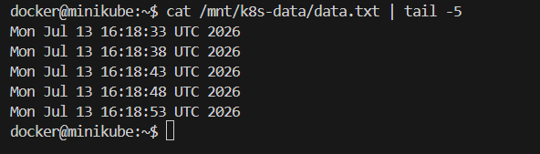

---

### Проверка после удаления PV

После удаления объекта PersistentVolume файл продолжает существовать.

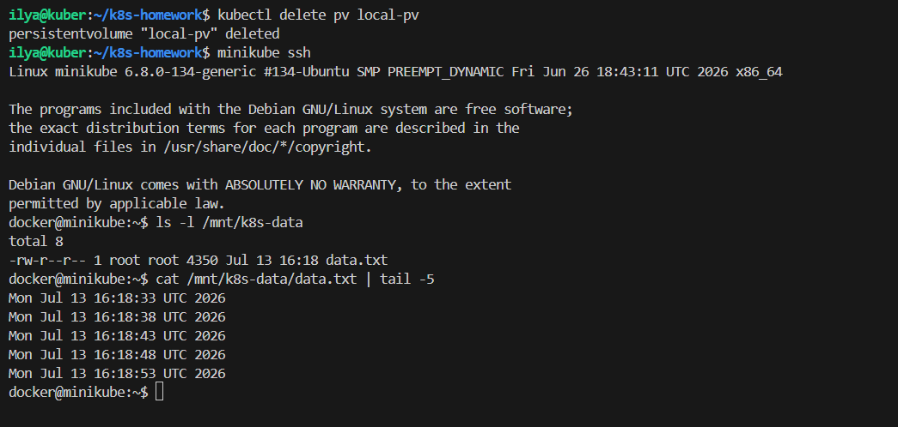

### Почему данные сохранились?

Удаление объекта PersistentVolume удаляет только объект Kubernetes.

Поскольку используется тип хранилища `hostPath`, сами данные находятся на файловой системе ноды Minikube и не удаляются автоматически.

---

# Задание 3. StorageClass

## Цель

Создать собственный StorageClass и использовать его совместно с PersistentVolumeClaim.

## Выполнение

Созданы:

- StorageClass `manual-sc`;
- PersistentVolume `sc-pv`;
- PersistentVolumeClaim `sc-pvc`;
- Deployment `data-exchange-sc`.

StorageClass использует

```yaml
provisioner: kubernetes.io/no-provisioner
```

поэтому PersistentVolume создается вручную.

---

### Проверка ресурсов

После применения манифеста все ресурсы успешно созданы.

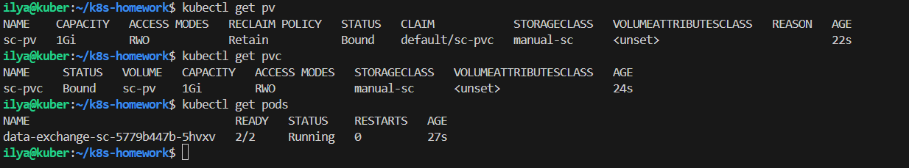

---

### Проверка обмена данными

Контейнер `busybox` записывает данные каждые 5 секунд.

Контейнер `network-multitool` успешно читает общий файл.

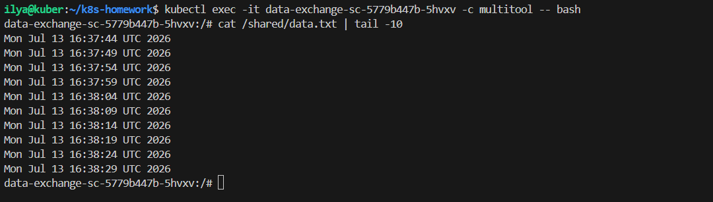

---

# Структура репозитория

```
.
├── README.md
├── containers-data-exchange.yaml
├── pv-pvc.yaml
└── sc.yaml
```

---

# Итог

В ходе выполнения домашнего задания были изучены основные способы работы с хранилищами в Kubernetes:

- использование `emptyDir` для обмена данными между контейнерами Pod;
- создание и использование `PersistentVolume`;
- подключение `PersistentVolume` через `PersistentVolumeClaim`;
- использование собственного `StorageClass`;
- влияние политики `persistentVolumeReclaimPolicy: Retain`;
- хранение данных в `hostPath` и их сохранение после удаления ресурсов Kubernetes.
